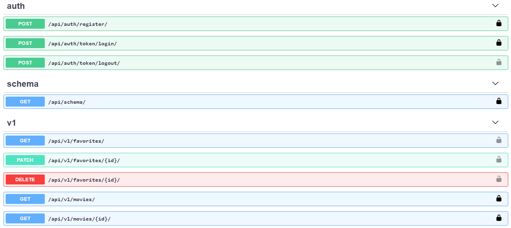
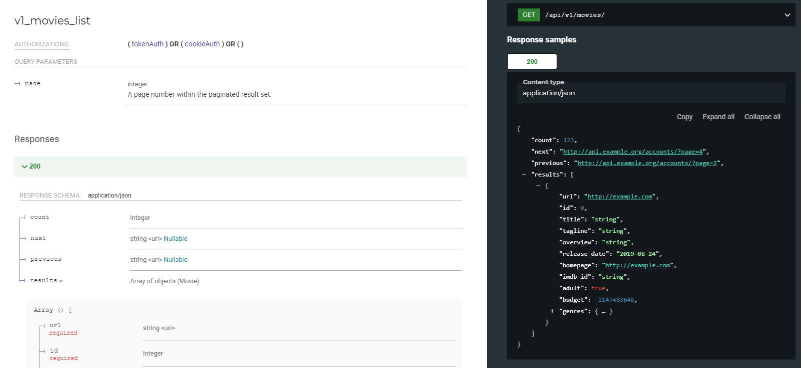

# Deltologic recruitment task (movies API)


The following project is a REST API, which can be used to:
- gather information about movies
- create user accounts
- login to get an authentication token
- remove or add a movie from/to your favorites

## Technology stack
- 🐍 Django REST Framework
- 📙 PostgreSQL
- 🌐 NGINX
- 🐋 Docker

## Movie dataset
As an example, a public domain [The Movies Dataset](https://www.kaggle.com/rounakbanik/the-movies-dataset) was used. This dataset contains detailed information about 45,000 movies.
The dataset can be found in this repository in the `movies_metadata.csv` file. Movie data is automatically imported to the database (if needed) in the docker-compose service startup script.

It can also be imported manually using the following command:
```
python manage.py populate
```

## Automated deployment
The project can be easily deployed using Docker. Every Python dependency and the Postgres database will be installed inside their corresponding containers. All you need to do is:
```
docker-compose up
```
The service will be running on port 81 by default.

## Testing
This project includes tests that check if each API endpoint behaves correctly. Tests are executed automatically on this repository on each push, thanks to GitHub Actions, but they can also be executed manually using:
```
python manage.py test
```

## API Documentation
The API provides an OpenAPI 3.0 compliant documentation, which can be easily browsed using two available interfaces.

### Swagger UI
Allows you to see the API endpoint list and try each one out in an easy way. It can be accessed at `/api/schema/swagger-ui/`. If deployed using Docker, the default URL would be: http://127.0.0.1:81/api/schema/swagger-ui/



### ReDoc
A more detailed API documentation can be accessed using ReDoc at `/api/schema/redoc/`. If deployed using Docker, the default URL would be: http://127.0.0.1:81/api/schema/redoc/


